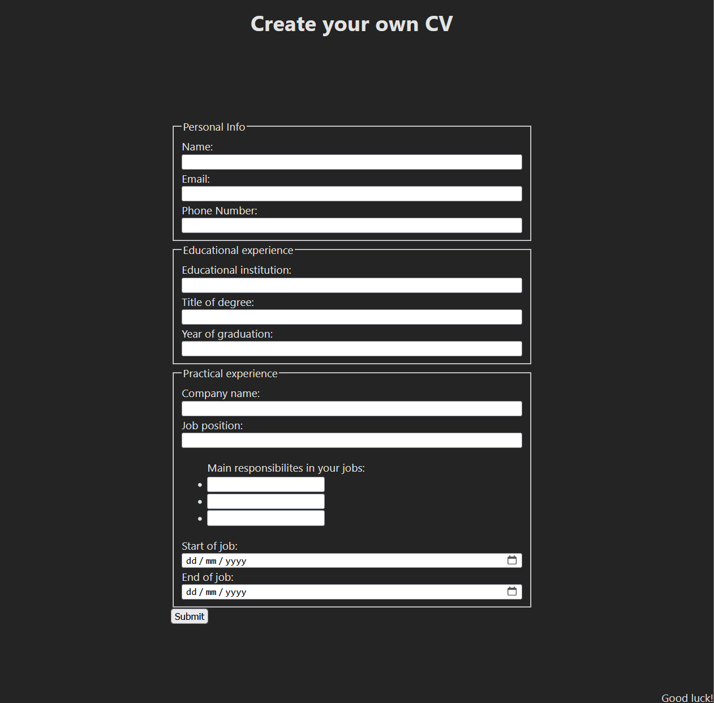

# CV application

This project uses React for the frontend. Project aims to practice useState hook and props in React components. Furthermore, familiarity is gained with deploying a React frontend to a Platform as a Service like Netlify.

## The Odin Project: Lesson CV Application

This project is build according to the specification of the [CV Application lesson](https://www.theodinproject.com/lessons/node-path-react-new-cv-application)

## Live website

Access the [CV Application](https://main--admirable-pothos-596c43.netlify.app/)

## Run locally

*In order to run project locally NodeJS + Git needs to installed on your system*

Follow these steps on Mac/Linux/WSL to run the project locally:

1. Open a terminal and go to a directory you want the repository to be in
2. Select Code in the Github project page and copy the SSH URL
3. git clone *SSH URL*
4. 'cd' into the repository you just cloned
5. Run 'npm install'
6. Run 'npm run dev'
7. Open the link that is shown in the terminal in your browser
